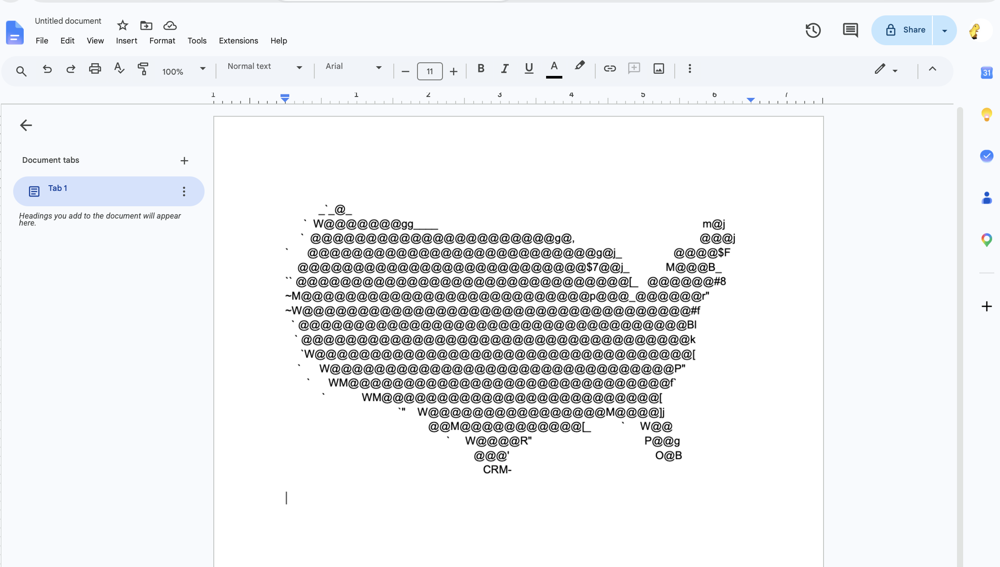

# Asciify

Asciify turns images into variable-width ASCII art designed to render
accurately in Google Docs.

Instead of treating every character as the same size, it uses glyphs measured
from Google Docs PDF exports. The beam search accounts for each character's
actual shape, width, and pair spacing while building the image.


## Google Docs Output

The generated ASCII is calibrated to preserve the image when pasted into
Google Docs using the matching Arial font size:



## Quick Start

Install the dependencies:

```bash
python3 -m pip install -r requirements.txt
```

Place an image in `input/`, then render it:

```bash
python3 asciify_mk2.py input/example.png --font-size 11
```

The generated text and report will be written to:

```text
output/example/font_11.txt
output/example/font_11_report.json
```

Copy the text into Google Docs, select all, and apply the matching Arial font
size. Available calibrated sizes are `1`, `5`, `8`, `11`, `15`, and `20`.
Google Docs displays size `1` as `2.25pt`.

## Watch the Search

Asciify can record the image forming as every row searches concurrently:

```bash
python3 asciify_mk2.py input/example.png \
  --font-size 11 \
  --visualize-progress output/example/font_11_progress.mp4 \
  --workers 8
```

This requires `ffmpeg`.

## Color Output

Use the color renderer to include a limited RGB palette in the beam search:

```bash
python3 asciify_mk2_color.py input/example.png --font-size 11
```

It writes plain text, a JSON report, and a rich HTML file under
`output/example/`. Open the HTML file, select the colored ASCII art, and copy
it into Google Docs. The `asciify-2-web/` app provides color output as a toggle
and copies the same kind of rich colored text directly to the clipboard.

## How It Works

1. Google Docs calibration PDFs provide exact Arial glyph shapes, widths, line
   heights, and pair-spacing adjustments.
2. The source image is divided into horizontal rows.
3. A beam search builds the best character sequence for each row.
4. The final text, quality scores, and layout settings are saved together.

The bundled calibration models cover all printable ASCII characters at each
supported font size.

## Diagnostic Preview

Render the exact image Asciify believes its text produces:

```bash
python3 render_glyph_preview.py output/example/font_11.txt \
  --report output/example/font_11_report.json \
  --output output/example/font_11_preview.png
```

Comparing this preview with Google Docs helps distinguish search-quality issues
from text-rendering differences.

## More Commands

See [COMMANDS.md](COMMANDS.md) for:

- rendering every calibrated font size,
- quality and layout controls,
- progress-video settings,
- diagnostic previews,
- rebuilding calibration models.

## Project Layout

- `asciify_mk2.py`: main beam-search renderer.
- `render_glyph_preview.py`: diagnostic renderer for generated text.
- `input/`: source images.
- `output/`: generated text, reports, previews, and videos.
- `calibration-models/`: extracted Google Docs glyph and layout data.
- `calibration-pdfs/`: source Google Docs calibration exports.
